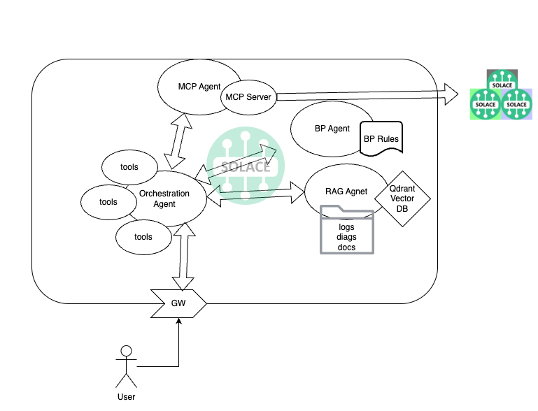
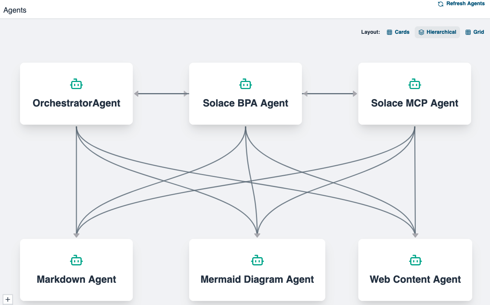
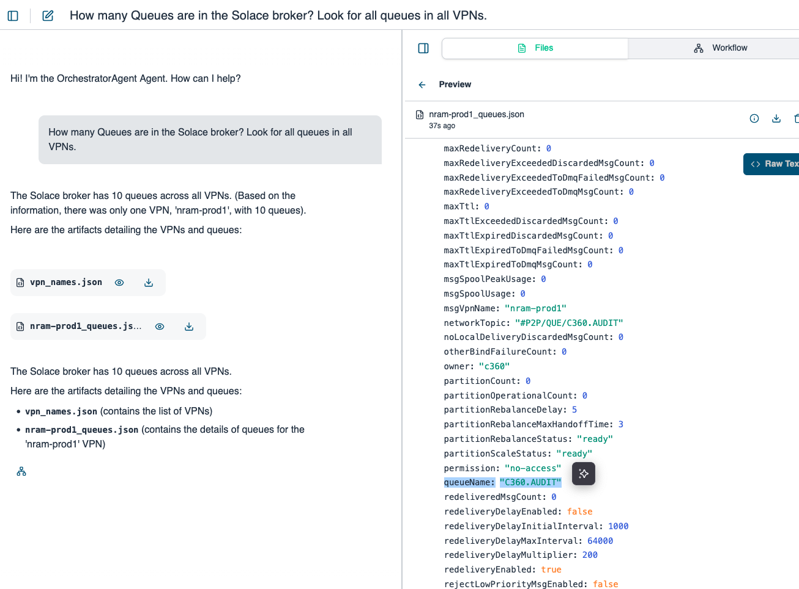
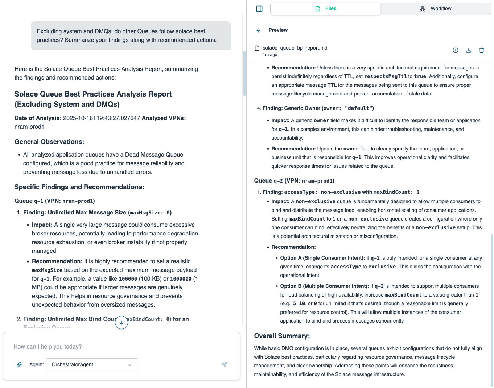

# Solace health check with Solace Agent Mesh

Multi-agent system for Solace broker health check. This an experimental and demo implementation.

## Architecture



## Containers



### Default Containers (Start Automatically)

**Solace Broker** (`solace-broker`)  
Solace PubSub+ message broker. Core messaging infrastructure for agent communication.

**Orchestrator Agent** (`orch-agent`)  
Coordinates all agent interactions and workflows. Entry point for all requests via REST API on port 8001.

**Solace Best Practices Agent** (`bpa-agent`)  
Analyzes Solace broker configurations against best practices and provides recommendations.

**Solace MCP Agent** (`mcp-agent`)  
Provides read-only access to Solace broker monitoring via SEMP v2 API. Enables querying broker state, clients, queues, etc.

### Optional Containers (Start on Demand)

**MySQL** (`mysql-server`)  
MySQL database server for SQL agent operations.

**Qdrant** (`qdrant`)  
Vector database for RAG agent semantic search and embeddings.

**RAG Agent** (`rag-agent`)  
Analyzes Solace configurations using vector embeddings and semantic search. Requires Qdrant.

**SQL Agent** (`sql-agent`)  
Executes database queries and operations. Requires MySQL.

## Sample Usage





## Quick Start

```bash
# 1. Create Python virtual environment
python3 -m venv .venv
source .venv/bin/activate
pip install -r requirements.txt

# 2. Create directories
mkdir -p config/{solace-broker,orch-agent,solace-bp-agent,solace-mcp-agent/repos}
mkdir -p data/{solace-broker/{config,spool,logs},orch-agent,solace-bp-agent,solace-mcp-agent,sam-artifacts}
chmod 777 data/sam-artifacts

# 3. Configure environment
cp env.sample .env  # Edit with your values

# 4. Create Docker network
docker network create sam-network

# 5. Start services
docker-compose up -d
```

## Starting
```
➜  docker-compose up -d
[+] Running 4/4
 ✔ Container solace-broker  Healthy                    26.3s
 ✔ Container orch-agent     Healthy                    36.3s
 ✔ Container bpa-agent      Started                    36.4s
 ✔ Container mcp-agent      Started                    36.4s
 ```

## Services

| Service | Port | Description |
|---------|------|-------------|
| Solace Broker | 8080 | PubSub+ broker (admin/admin) |
| Orchestrator | 8001 | Main agent coordinator |
| BPA Agent | - | Best practices analyzer |
| MCP Agent | - | Solace monitoring/management |

## Health Checks


### All services
``` bash
➜  docker-compose ps

NAME            IMAGE                                  COMMAND                  SERVICE         CREATED       STATUS                 PORTS
bpa-agent       solace-agent-mesh-enterprise:1.0.37    "solace-agent-mesh r…"   bpa-agent       4 hours ago   Up 4 hours             5002/tcp, 8000/tcp
mcp-agent       solace-agent-mesh-enterprise:1.0.37    "solace-agent-mesh r…"   mcp-agent       4 hours ago   Up 4 hours             5002/tcp, 8000/tcp
orch-agent      solace-agent-mesh-enterprise:1.0.37    "solace-agent-mesh r…"   orch-agent      4 hours ago   Up 4 hours (healthy)   0.0.0.0:8001->8001/tcp
solace-broker   solace/solace-pubsub-standard:latest   "/usr/sbin/boot.sh"      solace-broker   4 hours ago   Up 4 hours (healthy)   0.0.0.0:1883->1883/tcp, [::]:1883->1883/tcp, 0.0.0.0:5550->5550/tcp, [::]:5550->5550/tcp, 0.0.0.0:5672->5672/tcp, [::]:5672->5672/tcp, 0.0.0.0:8000->8000/tcp, [::]:8000->8000/tcp, 0.0.0.0:8008->8008/tcp, [::]:8008->8008/tcp, 0.0.0.0:8080->8080/tcp, [::]:8080->8080/tcp, 0.0.0.0:9000->9000/tcp, [::]:9000->9000/tcp, 0.0.0.0:55443->55443/tcp, [::]:55443->55443/tcp, 0.0.0.0:55333->55555/tcp, [::]:55333->55555/tcp
```

### Solace broker
```
➜   curl -v http://localhost:5550/health-check/guaranteed-active
* Host localhost:5550 was resolved.
* IPv6: ::1
* IPv4: 127.0.0.1
*   Trying [::1]:5550...
* Connected to localhost (::1) port 5550
> GET /health-check/guaranteed-active HTTP/1.1
> Host: localhost:5550
> User-Agent: curl/8.7.1
> Accept: */*
>
* Request completely sent off
< HTTP/1.1 200 OK
```
### Orchestrator
```
➜   curl http://localhost:8001/health
{"status":"A2A Web UI Backend is running"}%
```

## Common Commands

```bash
# View logs
docker-compose logs -f [service-name]

# Restart service
docker-compose restart [service-name]

# Stop all
docker-compose down

# Clean restart
docker-compose down

```

## Directory Structure

```
├── config/              # All configuration files
│   ├── {service}/      # Service-specific configs
│   └── {agent}/        # Agent-specific configs
└── data/               # All runtime data (git-ignored)
    ├── {service}/      # Service data
    ├── {agent}/        # Agent data
    └── sam-artifacts/  # Shared artifacts
```


## Requirements

- Python 3.8+
- Docker & Docker Compose
- 8GB RAM minimum
- 10GB free disk space

## Environment Variables

Create `.env` file with:

```bash
# Solace
SOLACE_BROKER_URL=tcp://solace-broker:55555
SOLACE_VPN=default
SOLACE_USERNAME=admin
SOLACE_PASSWORD=admin
```

## Optional Services

MySQL, Qdrant, RAG, and SQL agents are available but not started by default.

**To enable:**
```bash
# Start all optional services
docker-compose --profile optional up -d

# Or start individually
docker-compose up -d mysql-server
docker-compose up -d qdrant
docker-compose up -d rag-agent
docker-compose up -d sql-agent
```

## Troubleshooting

Check logs for any issues:
```bash
docker-compose logs -f [service-name]
```

Common fixes:
```bash
# Fix shared artifacts permissions
chmod 777 data/sam-artifacts

# Restart a service
docker-compose restart [service-name]
```
